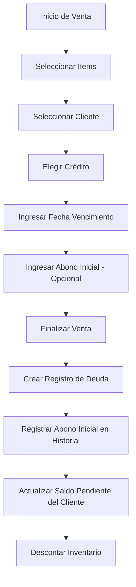
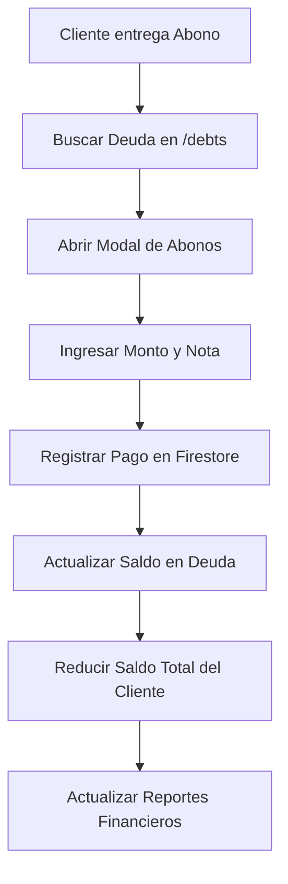

# 📋 Manual Técnico y Operacional: Pos-System (v2.0)

Este documento es la fuente oficial de verdad para el desarrollo, mantenimiento y operación del sistema de Punto de Venta (POS) multi-usuario.

---

## 1. 🏗️ Arquitectura del Sistema

El sistema está construido siguiendo principios modernos de aplicaciones web escalables y seguras.

### Stack Tecnológico
- **Frontend**: Next.js 14 (App Router) con TypeScript.
- **Backend-as-a-Service**: Firebase 10.
    - **Firestore**: Base de datos NoSQL para almacenamiento en tiempo real.
    - **Authentication**: Gestión de sesiones y protección de identidad.
- **Estilos**: Tailwind CSS para una interfaz reactiva y premium.
- **Gráficos**: Recharts para visualización de datos financieros.

### Modelo Multi-usuario
El sistema utiliza una arquitectura de **Colecciones Planas con Filtrado por Dueño**:
1. Cada documento en Firestore tiene un campo `userId`.
2. Los servicios del sistema inyectan automáticamente el `uid` del usuario autenticado en todas las consultas.
3. Esto garantiza que el Usuario A jamás pueda ver los productos, ventas o clientes del Usuario B, incluso si están en la misma base de datos.

---

## 2. 📁 Mapa del Proyecto (Estructura de Carpetas)

```bash
/
├── app/                # Rutas y Páginas (Next.js App Router)
├── components/         # Componentes de Interfaz organizados por módulo
├── hooks/              # Hooks personalizados (Conexión UI <-> Lógica)
├── lib/                # Configuración de librerías (Firebase, etc.)
├── services/           # Lógica de Negocio y Comunicación con Firestore
├── types/              # Definiciones de tipos TypeScript (Modelos)
└── public/             # Activos estáticos (Imágenes, Iconos)
```

### Detalle de Módulos (Rutas `/app`)
- `/sales`: Interface principal de ventas y carrito.
- `/inventory`: Gestión de stock y catálogo de productos.
- `/customers`: Base de datos de clientes y CRM básico.
- `/debts`: Seguimiento de cuentas por cobrar y pagos de crédito.
- `/promotions`: Creación de combos y ofertas.
- `/daily-report`: Resumen de operaciones del día actual.
- `/monthly-report`: Historial financiero mensual.
- `/analytics`: Dashboard de gráficas e inteligencia de negocio.

---

## 3. 💾 Modelos de Datos (Types)

El sistema maneja los siguientes objetos principales:

- **Product**: `id, name, stock, price, cost, userId, createdAt`
- **Customer**: `id, name, phone, totalDebt, totalSpent, userId`
- **Promotion**: `id, name, finalPrice, products: {productId, quantity}[], userId`
- **Sale**: `id, items: CartItem[], totalAmount, paymentMethod, customerId, month, year, userId`
- **Debt**: `id, customerId, saleId, amount, paidAmount, dueDate, status (pending/partial/paid), userId`
- **Payment**: `id, debtId, amount, date, note, userId`

---

## 4. ⚙️ Catálogo de Servicios (Lógica Interna)

Cada archivo en `/services` contains funciones críticas para el negocio:

### `productService.ts`
- `getAll()`: Obtiene productos del usuario actual.
- `create(product)`: Registra nuevo producto.
- `update(id, updates)`: Modifica datos existentes.
- `delete(id)`: Elimina producto.
- `decrementStock(id, q)`: Resta unidades tras una venta.
- `incrementStock(id, q)`: Suma unidades tras una cancelación.

### `salesService.ts`
- `create(sale)`: Ejecuta la transacción completa:
    1. Registra la venta.
    2. Descuenta stock de productos (individuales o combos).
    3. Actualiza el gasto total del cliente.
    4. Si es crédito, dispara la creación de una deuda con soporte para abono inicial.
- `remove(sale)`: Revierte la transacción (restaura stock y saldos).

### `debtService.ts`
- `getAll()`: Recupera todas las deudas del usuario.
- `addPayment(debtId, amount, note)`: Registra un abono parcial, actualiza el saldo de la deuda y ajusta el saldo total del cliente de forma atómica. Incluye protección contra pagos en exceso.
- `getPayments(debtId)`: Obtiene el historial de abonos de una deuda específica.
- `markAsPaid(id)`: Liquida el saldo restante de una deuda.

---

## 5. 🔄 Flujos Operacionales

### Flujo de una Venta a Crédito con Abono


### Flujo de Cobranza (Abonos)


---

## 6. 🔒 Seguridad y Mantenimiento

### Reglas de Acceso
> [!IMPORTANT]
> Se ha eliminado el acceso de super-admin (`lagaalfonso1@gmail.com`). Actualmente, el sistema es 100% privado. Nadie, excepto el dueño de los datos, puede visualizarlos.

### Guía de Mantenimiento (Firebase)
Para actualizar la conexión a la base de datos:
1. Ir a `lib/firebase.ts`.
2. Asegurarse de que las variables de entorno en `.env.local` coincidan con las llaves de Firebase Console.
3. Las reglas de seguridad en Firestore deben configurarse para validar el `request.auth.uid == resource.data.userId`.
4. **Nota sobre Índices**: El sistema de abonos realiza consultas filtradas por `userId` y `debtId`. No requiere índices compuestos complejos ya que el ordenamiento se maneja en memoria para mayor compatibilidad.

---
*Manual actualizado el 21 de Abril, 2026. Sistema de abonos y pagos parciales integrado.*
